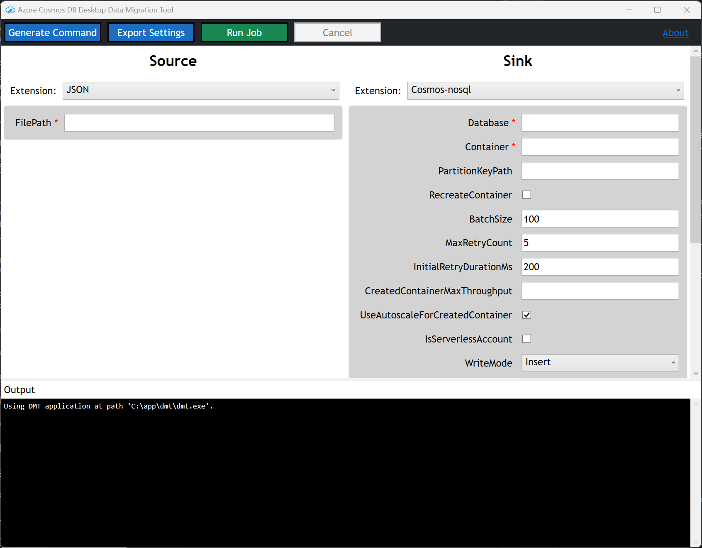
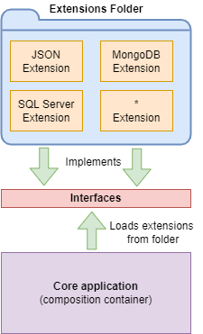
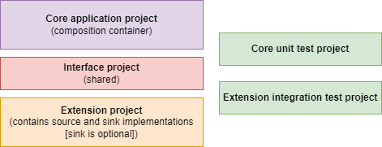
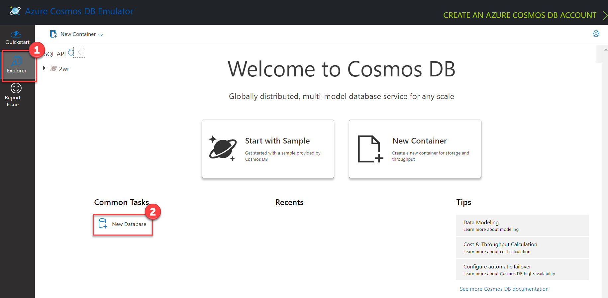
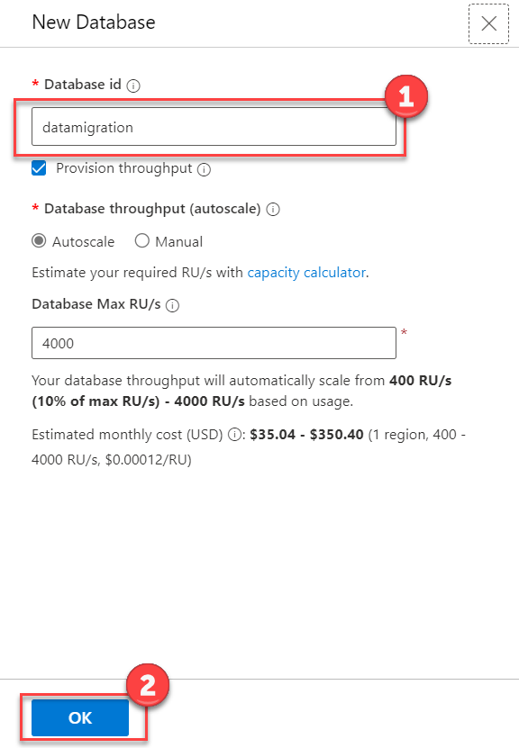
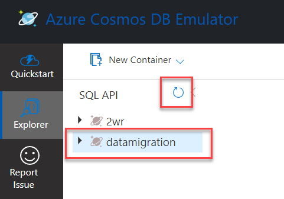
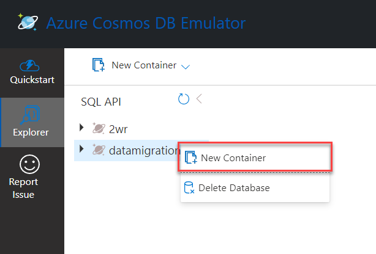
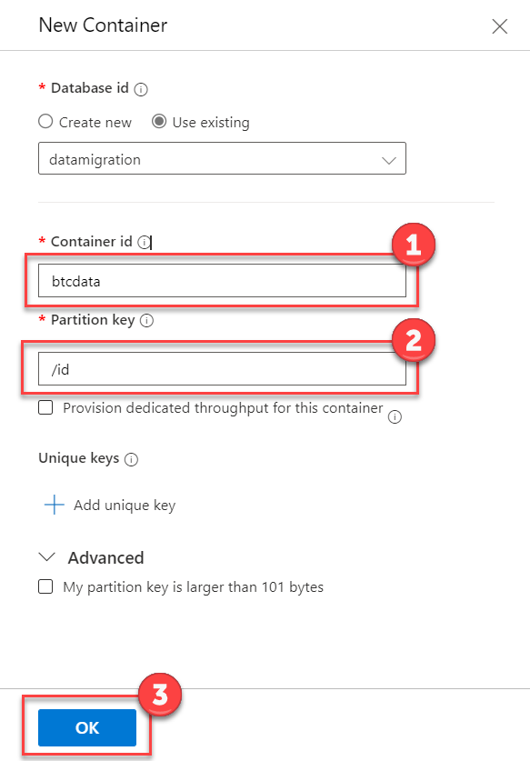
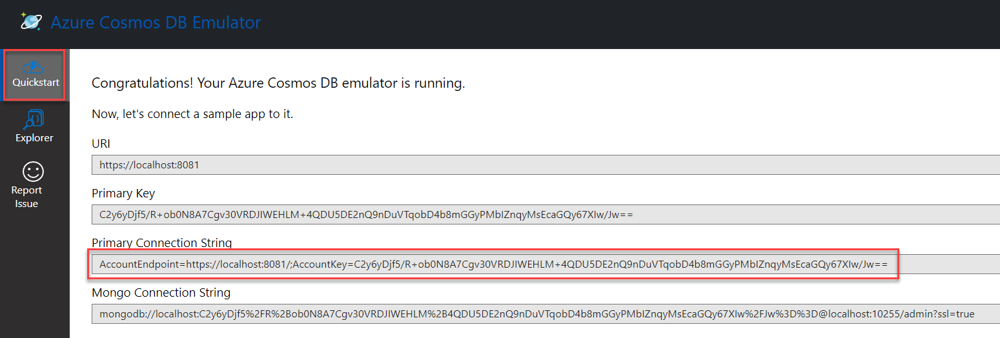

# Azure Cosmos DB Desktop Data Migration Tool

To access the archived version of the tool, navigate to the [**Archive branch**](https://github.com/Azure/azure-documentdb-datamigrationtool/tree/archive).

---

- [Azure Cosmos DB Desktop Data Migration Tool](#azure-cosmos-db-desktop-data-migration-tool)
  - [Overview](#overview)
  - [Extension documentation](#extension-documentation)
  - [Architecture](#architecture)
  - [Project Structure](#project-structure)
  - [Getting Started](#getting-started)
    - [Clone the source code repository](#clone-the-source-code-repository)
    - [Build the solution](#build-the-solution)
  - [Tutorial: JSON to Cosmos DB migration](#tutorial-json-to-cosmos-db-migration)
    - [Tutorial Software prerequisites](#tutorial-software-prerequisites)
    - [Task 1: Provision a sample database and container using the Azure Cosmos DB Emulator as the destination(sink)](#task-1-provision-a-sample-database-and-container-using-the-azure-cosmos-db-emulator-as-the-destinationsink)
    - [Task 2: Prepare JSON source documents](#task-2-prepare-json-source-documents)
    - [Task 3: Setup the data migration configuration](#task-3-setup-the-data-migration-configuration)
  - [Using the command line](#using-the-command-line)
  - [Creating Extensions](#creating-extensions)

## Overview

The Azure Cosmos DB Desktop Data Migration Tool is an open-source project containing a command-line application that provides import and export functionality for Azure Cosmos DB. For Windows, a GUI application is also provided as a wrapper around the command-line functionality.

## Quick Installation

To use the tool, download the latest zip file for your platform (win-x64, mac-x64, or linux-x64) from [Releases](https://github.com/AzureCosmosDB/data-migration-desktop-tool/releases) and extract all files to your desired install location. For Windows you can choose either the command line only (`dmt-2.x-win`) or a complete package that also includes the GUI (`dmt-gui-2.x-win`).

### Command Line
To begin a data transfer operation, first populate the `migrationsettings.json` file with appropriate settings for your data source and sink (see [detailed instructions](#using-the-command-line) below or [review examples](ExampleConfigs.md)), and then run the application from a command line: `dmt.exe` on Windows or `dmt` on other platforms.

### GUI (Windows only)
To begin a data transfer operation, launch the `dmt-gui-win.exe` application. Choose both a Source and Sink from the available options and then fill in required and optional settings. To run an operation with the current settings click the **Run Job** button at the top of the screen. Application output and error messages can be seen at the bottom of the screen.



## Extension documentation

Multiple extensions are provided in this repository. Find the documentation for the usage and configuration of each using the links provided:

1. [Azure Cosmos DB](Extensions/Cosmos/README.md)

1. [Azure Table API](Extensions/AzureTableAPI/README.md)

1. [JSON](Extensions/Json/README.md)

1. [MongoDB](Extensions/Mongo/README.md)

1. [SQL Server](Extensions/SqlServer/README.md)

1. [Parquet](Extensions/Parquet/README.md)

1. [CSV](Extensions/Csv/README.md)

1. [File Storage](Interfaces/Cosmos.DataTransfer.Common/README.md)

1. [Azure Blob Storage](Extensions/AzureBlob/README.md)

1. [AWS S3](Extensions/AwsS3/README.md)

6. [Azure Cognitive Search](Extensions/CognitiveSearch/README.md)

## Architecture

The Azure Cosmos DB Desktop Data Migration Tool is a lightweight executable that leverages the [Managed Extensibility Framework (MEF)](https://docs.microsoft.com/en-us/dotnet/framework/mef/). MEF enables decoupled implementation of the core project and its extensions. The core application is a command-line executable responsible for composing the required extensions at runtime by automatically loading them from the Extensions folder of the application. An Extension is a class library that includes the implementation of a System as a Source and (optionally) Sink for data transfer. The core application project does not contain direct references to any extension implementation. Instead, these projects share a common interface.



The GUI application executes command-line application commands to discover available extensions and details about the settings that they use. This allows it to provide identical operational functionality to running the command line app directly and takes advantage of the same set of extensions.

## Project Structure

The Cosmos DB Data Migration Tool core project is a C# command-line executable. The core application serves as the composition container for the required Source and Sink extensions. Therefore, the application user needs to put only the desired Extension class library assembly into the Extensions folder before running the application. In addition, the core project has a unit test project to exercise the application's behavior, whereas extension projects contain concrete integration tests that rely on external systems.



This project has adopted the [Microsoft Open Source Code of Conduct](https://opensource.microsoft.com/codeofconduct/). For more information see the [Code of Conduct FAQ](https://opensource.microsoft.com/codeofconduct/faq/) or contact [opencode@microsoft.com](mailto:opencode@microsoft.com) with any additional questions or comments.

## Getting Started

### Clone the source code repository

1. From a command prompt, execute the following command in an empty working folder that will house the source code.

```shell
git clone https://github.com/AzureCosmosDB/data-migration-desktop-tool.git
```

### Build the solution

1. Using Visual Studio 2022, open `CosmosDbDataMigrationTool.sln`.

2. Build the project using the keyboard shortcut <kbd>Ctrl</kbd>+<kbd>Shift</kbd>+<kbd>B</kbd> (<kbd>Cmd</kbd>+<kbd>Shift</kbd>+<kbd>B</kbd> on a Mac). This will build all current extension projects as well as the command-line **Core** application. The extension projects build assemblies get written to the **Extensions** folder of the **Core** application build. This way all extension options are available when the application is run.

3. The GUI application can be found in a separate `App/CosmosDbApp.sln` solution. This contains both the WPF application for Windows (`Cosmos.DataTransfer.App.Windows`) and a experimental MAUI Blazor implementation of the same UI (`Cosmos.DataTransfer.App`).

## Tutorial: JSON to Cosmos DB migration

This tutorial outlines how to use the Azure Cosmos DB Desktop Data Migration Tool to move JSON data to Azure Cosmos DB. This tutorial uses the Azure Cosmos DB Emulator.

### Tutorial Software prerequisites

1. [Visual Studio 2022](https://visualstudio.microsoft.com/vs/)
2. [.NET 6.0 SDK](https://dotnet.microsoft.com/en-us/download)
4. [Azure Cosmos DB Emulator](https://learn.microsoft.com/azure/cosmos-db/local-emulator) or Azure Cosmos DB resource.

### Task 1: Provision a sample database and container using the Azure Cosmos DB Emulator as the destination(sink)

1. Launch the Azure Cosmos DB emulator application and open <https://localhost:8081/_explorer/index.html> in a browser.

2. Select the **Explorer** option from the left menu. Then choose the **New Database** link found beneath the **Common Tasks** heading.

    

3. On the **New Database** blade, enter `datamigration` in the **Database id** field, then select **OK**.

    

4. If the **datamigration** database doesn't appear in the list of databases, select the **Refresh** icon.

    

5. Expand the ellipsis menu next to the **datamigration** database and select **New Container**.

   

6. On the **New Container** blade, enter `btcdata` in the **Container id** field, and `/id` in the **Partition key** field.  Select the **OK** button.

    

    >**Note**: When using the Cosmos DB Data Migration tool, the container doesn't have to previously exist, it will be created automatically using the partition key specified in the sink configuration.

### Task 2: Prepare JSON source documents

1. Locate the **docs/resources/sample-data.zip** file. Extract the files to any desired folder. These files serve as the JSON data that is to be migrated to Cosmos DB.

### Task 3: Setup the data migration configuration

1. Each extension contains a README document that outlines configuration for the data migration. In this case, locate the configuration for [JSON (Source)](Extensions/Json/README.md) and [Cosmos DB (Sink)](Extensions/Cosmos/README.md).

2. In the Visual Studio Solution Explorer, expand the **Microsoft.Data.Transfer.Core** project, and open **migrationsettings.json**. This file provides an example outline of the settings file structure. Using the documentation linked above, configure the **SourceSettings** and **SinkSettings** sections. Ensure the **FilePath** setting is the location where the sample data is extracted. The ConnectionString setting can be found on the Cosmos DB Emulator **Quickstart** screen as the **Primary Connection String**. Save the file.

    >**Note**: The alternate terms *Target* and *Destination* can be used in place of *Sink* in configuration files and command line parameters. For example `"Target"` and `"TargetSettings"` would also be valid in the below example.

    ```json
    {
        "Source": "JSON",
        "Sink": "Cosmos-nosql",
        "SourceSettings": {
            "FilePath": "C:\\btcdata\\simple_json.json"
        },
        "SinkSettings": {
            "ConnectionString": "AccountEndpoint=https://localhost:8081/;AccountKey=C2y6yDj...",
            "Database": "datamigration",
            "Container": "btcdata",
            "PartitionKeyPath": "/id",
            "RecreateContainer": false,
            "IncludeMetadataFields": false
        }
    }
    ```

    

3. Ensure the **Cosmos.DataTransfer.Core** project is set as the startup project then press <kbd>F5</kbd> to run the application.

4. The application then performs the data migration. After a few moments the process will indicate **Data transfer complete.** or **Data transfer failed**.

>**Note**: The `Source` and `Sink` properties should match the **DisplayName** set in the code for the extensions.

## Using the command line

1. Download the latest [release](https://github.com/AzureCosmosDB/data-migration-desktop-tool/releases), or ensure the project is [built](#build-the-solution).

2. The **Extensions** folder contains the [plug-ins available](#extension-documentation) for use in the migration. Each extension is located in a folder with the name of the data source. For example, the Cosmos DB extension is located in the folder **Cosmos**. Before running the application, you can open the **Extensions** folder and remove any folders for the extensions that are not required for the migration.

3. In the root of the build folder, locate the **migrationsettings.json** and update settings as documented in the [Extension documentation](#extension-documentation). Example file (similar to tutorial above):

    ```json
    {
        "Source": "JSON",
        "Sink": "Cosmos-nosql",
        "SourceSettings": {
            "FilePath": "C:\\btcdata\\simple_json.json"
        },
        "SinkSettings": {
            "ConnectionString": "AccountEndpoint=https://localhost:8081/;AccountKey=C2y6yDj...",
            "Database": "datamigration",
            "Container": "btcdata",
            "PartitionKeyPath": "/id",
            "RecreateContainer": false,
            "IncludeMetadataFields": false
        }
    }
    ```

> **Note**: **migrationsettings.json** can also be configured to execute multiple data transfer operations with a single run command. To do this, include an `Operations` property consisting of an array of objects that include `SourceSettings` and `SinkSettings` properties using the same format as those shown above for single operations. Additional details and examples can be found in [this blog post](https://codemindinterface.com/2023/03/cosmos-tool-operations/).

4. Execute the program using the following command:

    **Using Windows**

    ```bash
    dmt.exe
    ```

    > **Note**: Use the `--settings` option with a file path to specify a different settings file (overriding the default **migrationsettings.json** file). This facilitates automating running of different migration jobs in a programmatic loop.

    **Using macOS**

    ```bash
    ./dmt
    ```

    > **Note**: Before you run the tool on macOS, you'll need to follow Apple's instructions on how to [Open a Mac app from an unidentified developer](https://support.apple.com/guide/mac-help/open-a-mac-app-from-an-unidentified-developer-mh40616/mac).

## Creating Extensions

1. Decide what type of extension you want to create. There are 3 different types of extensions and each of those can be implemented to read data, write data, or both.
    
    1. DataSource/DataSink extension: Appropriate for data sources which include both a native data format and storage. Most databases fall under this category and generally your extension will be written using an SDK specific to that type of database. For example, SQL Server uses data structured as tables and is accessed through drivers that handle underlying communication with the database.
    1. Binary File Storage extension: Only concerned with the storage of binary files and is agnostic to the specific file format. Examples include files on local disk or cloud blob storage providers. This type of extension can be used by any File Format extension.
    1. File Format extension: Handles translating data for a specific binary file format but is agnostic to storage. Examples include JSON or Parquet. This type of extension can be combined with any Binary File Storage extension to create multiple DataSource/DataSink extensions. 

1. Add a new folder in the Extensions folder with the name of your extension.

2. Create the extension project and an accompanying test project.
    - The naming convention for extension projects is `Cosmos.DataTransfer.<Name>Extension`.
    - Extension projects should use .NET 6 framework and **Console Application** type. A Program.cs file must be included in order to build the console project. A Console Application Project is required to have the build include NuGet referenced packages.
    > Binary File Storage extensions are only used in combination with other extensions so should be placed in a .NET 6 **Class Library** without the additional debugging configuration needed below.
  
3. Add the new projects to the `CosmosDbDataMigrationTool` solution.

4. In order to facilitate local debugging the extension build output along with any dependencies needs to be copied into the `Core\Cosmos.DataTransfer.Core\bin\Debug\net6.0\Extensions` folder. To set up the project to automatically copy add the following changes.
    - Add a Publish Profile to Folder named `LocalDebugFolder` with a Target Location of `..\..\..\Core\Cosmos.DataTransfer.Core\bin\Debug\net6.0\Extensions`
    - To publish every time the project builds, edit the .csproj file to add a new post-build step:

    ```xml
    <Target Name="PublishDebug" AfterTargets="Build" Condition=" '$(Configuration)' == 'Debug' ">
       <Exec Command="dotnet publish --no-build -p:PublishProfile=LocalDebugFolder" />
    </Target>
    ```

5. Add references to the `System.ComponentModel.Composition` NuGet package and the `Cosmos.DataTransfer.Interfaces` project.

6. Extensions can implement either `IDataSourceExtension` to read data or `IDataSinkExtension` to write data. Classes implementing these interfaces should include a class level `System.ComponentModel.Composition.ExportAttribute` with the implemented interface type as a parameter. This will allow the plugin to get picked up by the main application.
    - Binary File Storage extensions implement the `IComposableDataSource` or `IComposableDataSink` interfaces. To be used with different file formats, the projects containing the formatters should reference the extension's project and add new `CompositeSourceExtension` or `CompositeSinkExtension` referencing the storage and formatter extensions.
    - File Format extensions implement the `IFormattedDataReader` or `IFormattedDataWriter` interfaces. In order to be usable each should also declare one or more `CompositeSourceExtension` or `CompositeSinkExtension` to define available storage locations for the format. This will require adding references to Storage extension projects and adding a declaration for each file format/storage combination. Example:
        ```csharp
        [Export(typeof(IDataSinkExtension))]
        public class JsonAzureBlobSink : CompositeSinkExtension<AzureBlobDataSink, JsonFormatWriter>
        {
            public override string DisplayName => "JSON-AzureBlob";
        }
        ```
    - Settings needed by the extension can be retrieved from any standard .NET configuration source in the main application by using the `IConfiguration` instance passed into the `ReadAsync` and `WriteAsync` methods. Settings under `SourceSettings`/`SinkSettings` will be included as well as any settings included in JSON files specified by the `SourceSettingsPath`/`SinkSettingsPath`.
    - To fully support a friendly settings list in the GUI application, your extension can implement the `IDataSinkExtensionWithSettings` or `IDataSourceExtensionWithSettings` interfaces which add an additional `GetSettings` method which should return any settings objects that your extension expects or requires. Properties of these objects will then be listed in the GUI.

8. Implement your extension to read and/or write using the generic `IDataItem` interface which exposes object properties as a list key-value pairs. Depending on the specific structure of the data storage type being implemented, you can choose to support nested objects and arrays or only flat top-level properties.
    > Binary File Storage extensions are only concerned with generic storage so only work with `Stream` instances representing whole files rather than individual `IDataItem`. 
